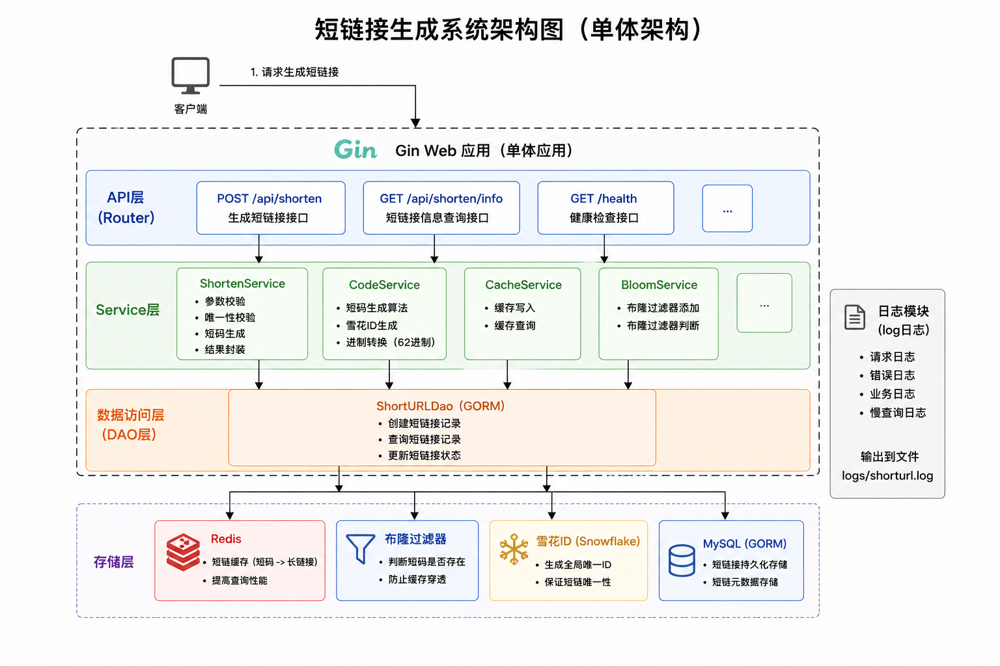
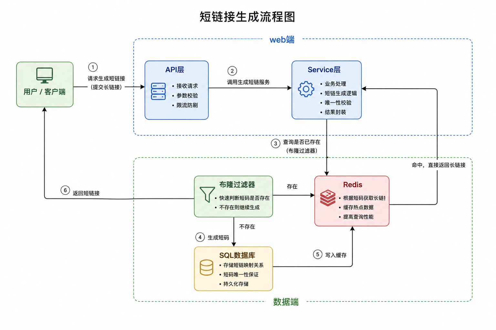
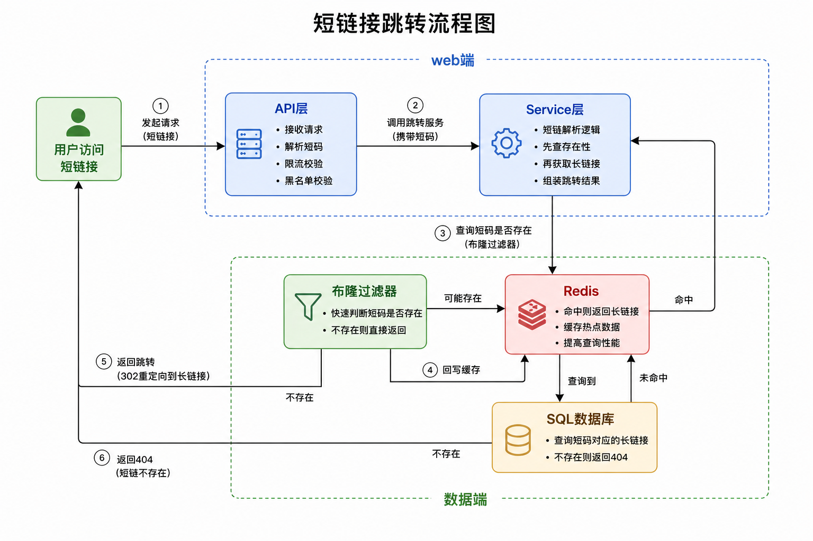
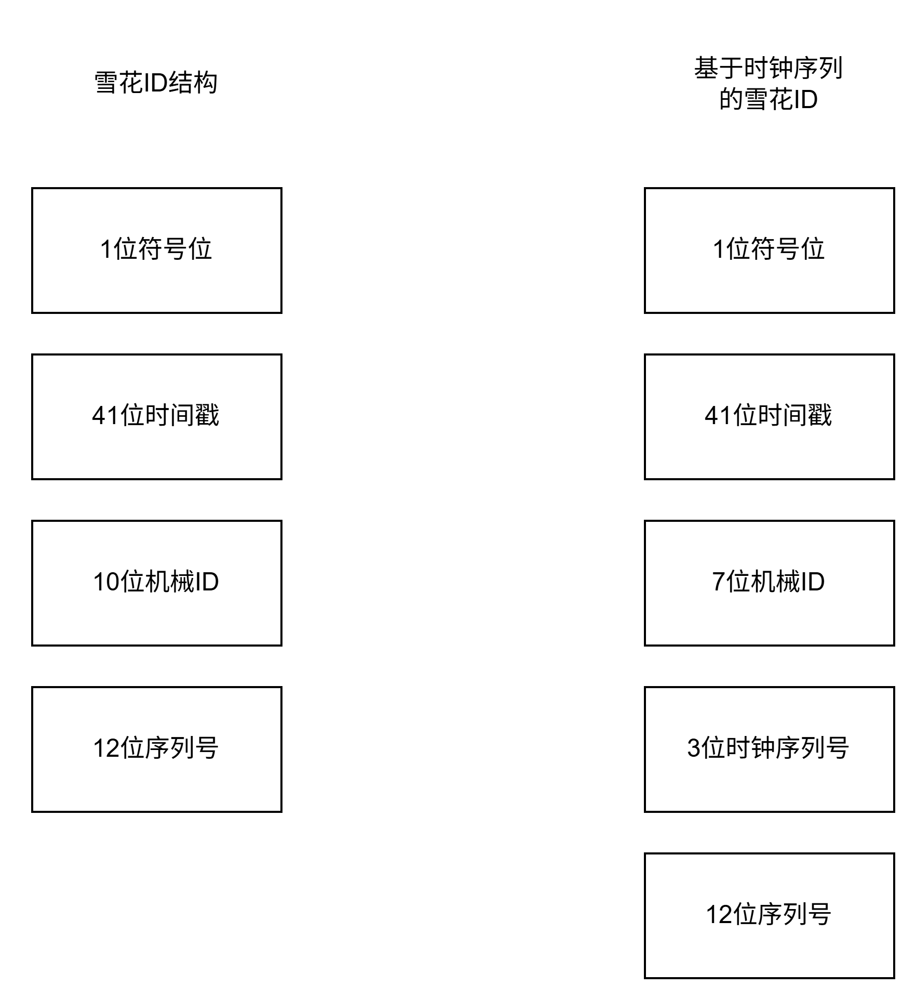
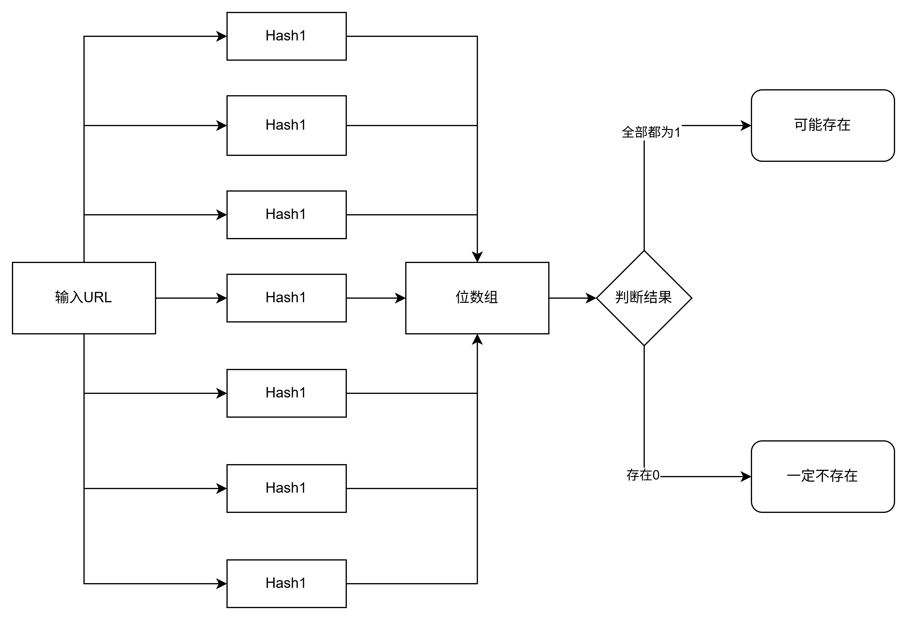

# 短链接系统架构文档

### 1. 项目概述
这是一个基于Gin框架开发的高性能短链接系统，带有缓存。系统采用前后端分离架构，提供完整的短链接生成、跳转、管理功能。

---
### 2. 整体架构设计
#### 2.1 系统架构图


#### 2.2 技术栈
前端技术栈  
- Vue 3: 渐进式JavaScript框架
- Vite: 现代化构建工具  
- Axios: HTTP客户端库
- CSS3: 现代化样式设计

后端技术栈
- Gin: HTTP Web框架（单体版本）
- GORM: ORM数据库操作

基础设施
- Mysql: 关系型数据库
- Redis: 内存缓存数据库
- Docker: 容器化以及redis的拉取 


---
### 3. 核心业务流程
#### 3.1 短链接生成流程

注：线条3应该指向布隆过滤器

#### 3.2 短链接跳转流程


----

### 4. 核心组件设计
#### 4.1 雪花算法ID生成器



时钟序列设计特点：
- 支持时钟回拨机制容错
- 机械ID范围 0~127
- 每毫秒可生成 2的12次幂个ID
- 理论上可以使用69年

  
项目使用自定义的 MySnowflake 实现，位分配为1（符号位）+ 41(时间) + 3(逻辑时钟) + 7(机器ID) + 12(序列)  
实现文件： 
```text
new_url\pkg\snowflake\snowflake.go
```

主要特性与改进点：
时钟回拨补偿：当检测到系统时间回退，使用时钟序列补偿，最多允许若干次回退再抛错。
单机并发序列：序列号 为 12 位（0-4095），每毫秒最多 4096 个 ID；如达到上限会等待下一毫秒以避免重复
机器 ID 获取：优先从配置文件 MACHINE_ID 读取

建议结构体：
```go
type SnowflakeIDGenerator struct {
	workerID      int64
	sequence      int64
	sequenceID    int64
	lastTimestamp int64
	mu            sync.Mutex
}
```

#### 4.2 布隆过滤器

配置参数:
- 预期元素数量：1,000,000
- 误判率：1%
- 哈希函数：7个（MD5+SHA1组合）
- 存储方式：Redis BF模块

----
### 5. 数据模型设计
#### 5.1 数据库表结构
```mysql
CREATE TABLE `url_map` (
  `id` bigint NOT NULL AUTO_INCREMENT COMMENT '主键ID',
  `long_url` varchar(512) NOT NULL COMMENT '原始长链接',
  `short_url` varchar(64) NOT NULL COMMENT '短链接',
  `is_custom` tinyint(1) NOT NULL DEFAULT 0 COMMENT '是否自定义短链 0=否 1=是',
  `expired_at` datetime DEFAULT NULL COMMENT '过期时间',
  PRIMARY KEY (`id`),
  UNIQUE KEY `idx_short_url` (`short_url`) COMMENT '短链接唯一索引'
) ENGINE=InnoDB DEFAULT CHARSET=utf8mb4 COMMENT='短链接映射表';
```
#### 5.2 redis数据结构
``` text
# 短链接缓存
KEY: {shortCode}
VALUE: {originalURL}
TTL: 24小时

# 布隆过滤器
KEY: shorturl:Bloom
TYPE: BF (Redis Bloom Filter)
```
--- 
### 6. 配置文件
```yaml
Server:
  HttpPort: :8082
  Mode: release
Database:
  DbType: mysql
  DbHost: localhost
  DbPort: 3306
  DbUser: root
  DbPassword: 123456
  DbName: urls
  MaxIdleConnections: 10
  MaxOpenConnections: 100
Redis:
  RdbPort: localhost:6379
  RdbPassword: ""
  Rdb: 0
# 布隆过滤器
Bloom:
  P: 0.01
  N: 1000000
# 雪花算法配置
Snowflake:
  MachineID: 1
  Epoch: 1735660800000
Logger:
  Level: debug
  LogType : std
```
--- 
### 7. 总结
#### 7.1 整体设计思路
- 短链生成器的核心：把长链接 → 唯一短字符串，并实现快速查询与跳转。
- 本项目采用 雪花算法（发号）+ 布隆过滤器（判重） 架构，兼顾高性能、高并发、无冲突、省资源。
#### 7.2 核心技术作用
- 雪花算法（Snowflake）—— 生成唯一 ID
   - 生成 64bit 全局唯一自增 ID。不依赖数据库自增，高并发下不重复。把生成的 10 进制 ID 转成 62 进制（0-9a-zA-Z）,最终得到 短链码（如：k8gT7）。
   - 优点：绝对唯一，不会重复。性能极高，单机每秒能生成百万ID。自带时间戳，可排序、可回溯。 
- 布隆过滤器（Bloom Filter）—— 快速判重
   - 作用：判断 “短链码是否已经存在”。
   - 特点：内存占用极小、判断速度 O (1),防止生成重复短链（尤其自定义短链 / 高并发场景） 比查数据库快 10~100 倍. 
   - 优点： 抗并发冲突 减少数据库查询压力 低内存、高性能 
#### 7.3 生成短链流程
用户传入长链接（可自定义短链），先查布隆过滤器是否存在，如果不存在的话在查redis，
如果不存在最后再查数据库，都不存在的话生成短链接。
最后在将生成的短链接依次存入数据库，缓存，布隆过滤器
   
#### 7.4 架构优势
- 全局唯一：雪花算法保证不重复
- 超高并发：不依赖数据库自增，无性能瓶颈
- 极快判重：布隆过滤器替代数据库判重
- 短链更短：62 进制压缩，长度短、美观
- 可扩展：支持分布式部署
- 安全稳定：防止重复、穿透、缓存击穿